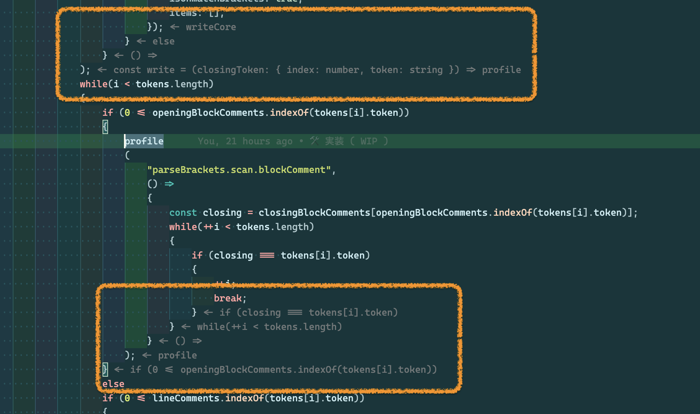
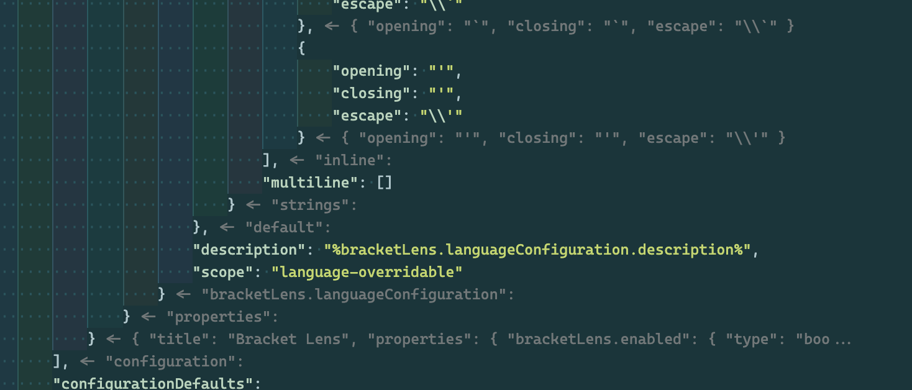

# Bracket Lens for VS Code

Show bracket header on closing bracket.

## Features

Displays the text in the header part of the scope after the closing brace.

### Screenshot

## Tutorial

### 0. ⬇️ Install Bracket Lens

Show extension side bar within VS Code(Mac:`Command`+`Shift`+`X`, Windows and Linux: `Ctrl`+`Shift`+`X`), type `Bracket Lens` and press `Enter` and click `Install`.

### 1. 👉 Show bracket header on closing bracket

Open the source code file for a symbol bracket type language like TypeScript. Information is automatically displayed after the closing brace.

### 2. 🔧 Next step

Please see [Notes](#notes). You can change [settings](#extension-settings). And you can edit [keyboard shortcuts](#keyboard-shortcut-settings) by `keybindings.json`.

Enjoy!

## Commands

* `Bracket Lens: Report Profile` : Report a profile.

## Extension Settings

This extension contributes the following settings by [`settings.json`](https://code.visualstudio.com/docs/customization/userandworkspace#_creating-user-and-workspace-settings)( Mac: `Command`+`,`, Windows / Linux: `File` -> `Preferences` -> `User Settings` ):

* `bracketLens.enabled`: Temporarily apply the settings before confirming.
* `bracketLens.debug`: Debug mode.
* `bracketLens.color.description`: The color of the bracket header that appears after the closing bracket.
* `bracketLens.prefix.description`: Bracket header prefix.
* `bracketLens.unmatchBracketsPrefix`: Bracket header prefix when unmatch brackets.
* `bracketLens.maxBracketHeaderLength`: Bracket header length than this value are displayed with the tail omitted. ( not include prefix )
* `bracketLens.minBracketScopeLines`: The bracket header is displayed only when the number of lines in the bracket scope is greater than or equal to this value. ( include bracket lines )
* `bracketLens.languageConfiguration`: Language parsing settings.

## Notes

### For users with language syntax like TypeScript

Fortunately, this extension will probably work generally comfortably in the symbol bracktes type language without any special configuration.

Even for this type of language, details may require the setting of `bracketLens.languageConfiguration`. I would like to accept it as the default setting if you can tell me the setting information in the [issue](https://github.com/wraith13/bracket-lens-vscode/issues) or [pull request](https://github.com/wraith13/bracket-lens-vscode/pulls) for other users in your language.

### For users with language syntax like Ruby

I apologize for the inconvenience, but for word bracket type languages, all word brackets must be set to `bracketLens.languageConfiguration`.

I would like to accept it as the default setting if you can tell me the setting information in the [issue](https://github.com/wraith13/bracket-lens-vscode/issues) or [pull request](https://github.com/wraith13/bracket-lens-vscode/pulls) for other users in your language.

### For users with language syntax like Python

Unfortunately, this extension is not useful for indented scope type languages.

If your language is this type of language, I would like to have this extension disabled in that language by default if you let us know in an [issue](https://github.com/wraith13/bracket-lens-vscode/issues) or [pull request](https://github.com/wraith13/bracket-lens-vscode/pulls).

## Keyboard shortcut Settings

You can edit keyboard shortcuts by [`keybindings.json`](https://code.visualstudio.com/docs/customization/keybindings#_customizing-shortcuts)
( Mac: `Code` -> `Preferences` -> `Keyboard Shortcuts`, Windows / Linux: `File` -> `Preferences` -> `Keyboard Shortcuts`).

Command name on `keybindings.json` is diffarent from on Command Pallete. See below table.

|on Command Pallete|on keybindings.json|default Keyboard shortcut|
|-|-|-|
|`Bracket Lens: Report Profile`|`bracketLens.reportProfile`|

## Release Notes

see ChangLog on [marketplace](https://marketplace.visualstudio.com/items/wraith13.bracket-lens/changelog) or [github](https://github.com/wraith13/bracket-lens-vscode/blob/master/CHANGELOG.md)

## Support

[GitHub Issues](https://github.com/wraith13/bracket-lens-vscode/issues)

## License

[Boost Software License](https://github.com/wraith13/bracket-lens-vscode/blob/master/LICENSE_1_0.txt)

## Other extensions of wraith13's work

|Icon|Name|Description|
|---|---|---|
| |[Background Phi Colors](https://marketplace.visualstudio.com/items?itemName=wraith13.background-phi-colors)|This extension colors the background in various ways.|
| |[Blitz](https://marketplace.visualstudio.com/items?itemName=wraith13.blitz)|Provide a quick and comfortable way to change settings by quick pick based UI.|
| |[Zoom Bar](https://marketplace.visualstudio.com/items?itemName=wraith13.zoombar-vscode)|Zoom UI in status bar for VS Code.|

See all wraith13's  expansions: <https://marketplace.visualstudio.com/publishers/wraith13>
